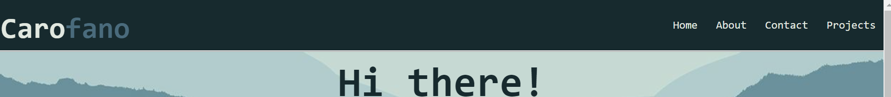
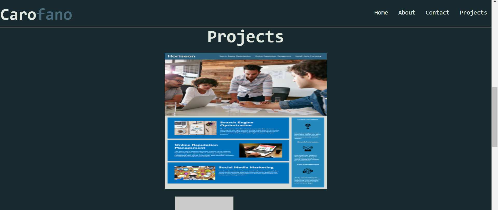

# Portfolio

## Description

* I wanted to design a portfolio showcasing my work to potential employers

* It was a challenge to align the elements in a way that I wanted, and also make those elements functional

* I have learned that simple and intuitive is the best approach to design, and I would like to totally re-design this portfolio with that in mind

* In the future I'd like to implement more clean and better features to this page. I want to add more projects, get things aligned and designed in a more pleasing way, and add some small QOL features regarding the layout

## Table of Contents
[Installation](#installation)
[Usage](#usage)
[Credits](#credits)
[License](#license)

## Installation

Follow these steps to create a local copy of this repository so you can edit too!
1. Navigate to https://github.com/stevecarofano/Homework-01
    
2. Find the green **Code** button on the right-hand side, click it and copy the repository URL with HTTPS or SSH keys
    
3. Open the command line or terminal on your machine and navigate to the destination you want the files to live in
    
4. Type git clone _pasteURLhere_
    
5. Hit Enter
    
6. Congratulations! You now have a local copy of this repository!

## Usage

Let's take a look at my portfolio and navigate to see some of my work!

Find the nav bar at the top of the page:
    
    
Then click any of the nav links to jump-to that section of the webpage!

Let's click the "Projects" link and see where it takes us
    
    
As you can see we are now at the section of the page containing some of my completed projects

Use any of the links in the nav bar to jump-to your desired content!

## Credits
This was a solo project but I found some helpful resources online

[w3schools flexbox](https://www.w3schools.com/css/css3_flexbox.asp)

## License 

MIT License

Copyright (c) [2021] [stevecarofano]

Permission is hereby granted, free of charge, to any person obtaining a copy
of this software and associated documentation files (the "Software"), to deal
in the Software without restriction, including without limitation the rights
to use, copy, modify, merge, publish, distribute, sublicense, and/or sell
copies of the Software, and to permit persons to whom the Software is
furnished to do so, subject to the following conditions:

The above copyright notice and this permission notice shall be included in all
copies or substantial portions of the Software.

THE SOFTWARE IS PROVIDED "AS IS", WITHOUT WARRANTY OF ANY KIND, EXPRESS OR
IMPLIED, INCLUDING BUT NOT LIMITED TO THE WARRANTIES OF MERCHANTABILITY,
FITNESS FOR A PARTICULAR PURPOSE AND NONINFRINGEMENT. IN NO EVENT SHALL THE
AUTHORS OR COPYRIGHT HOLDERS BE LIABLE FOR ANY CLAIM, DAMAGES OR OTHER
LIABILITY, WHETHER IN AN ACTION OF CONTRACT, TORT OR OTHERWISE, ARISING FROM,
OUT OF OR IN CONNECTION WITH THE SOFTWARE OR THE USE OR OTHER DEALINGS IN THE
SOFTWARE.

