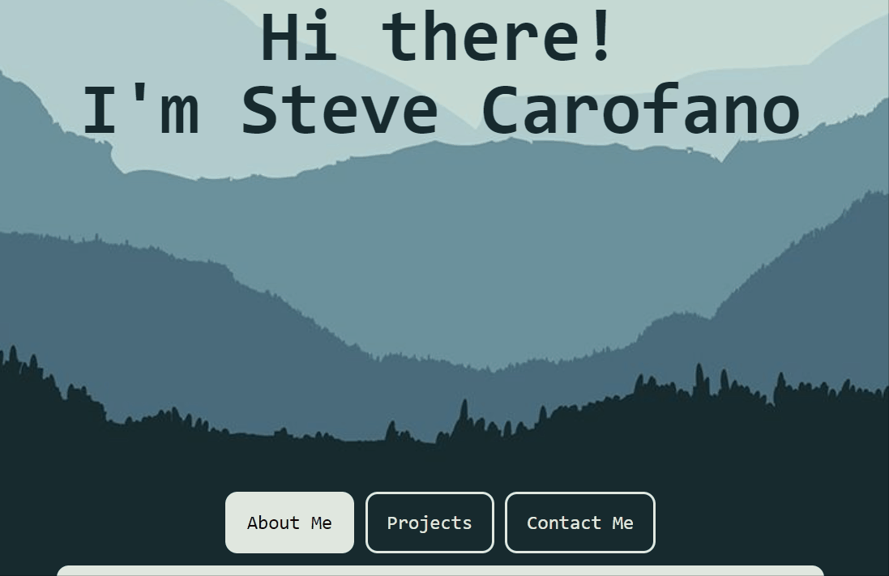

# Portfolio

## Description

Hi! I'm Steve Carofano and welcome to my page! This repo contains my official portfolio which displays
a brief "About Me" section, a "Projects" section highlighting my previous work, and a "Contact Me" section 
with all you need to get in touch with me. I've designed this web page with mobile formatting in mind,
and you should see that the layout is responsive to any viewport!

---

[Live site](https://stevecarofano.github.io/Portfolio-SC/)

---

## Table of Contents
[| Usage |](#usage)
[| Credits |](#credits)
[| License |](#license)

## Usage

Let's take a look at my portfolio and navigate around to see the features!

Here is a quick gif to showcase the basic functionality:
    
    
You can see that when you hover over a given element it will grow to signify your selection and when you click, it will take you to that destination in a new tab, for your convenience.

Check out my work, and send me an email to talk tech!

## Credits
[w3Schools](https://www.w3schools.com)
[w3schools flexbox](https://www.w3schools.com/css/css3_flexbox.asp)
[StackOverflow](https://www.stackoverflow.com)

## License 

/* Copyright (C) stevecarofano - All Rights Reserved
 * Unauthorized copying of this file, via any medium is strictly prohibited
 * Proprietary and confidential
 * Written by Steve Carofano <stevencarofano@gmail.com>, May 2021
 */

